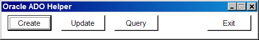
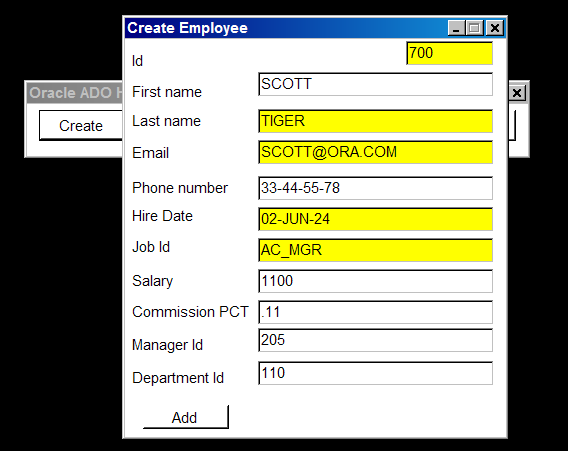
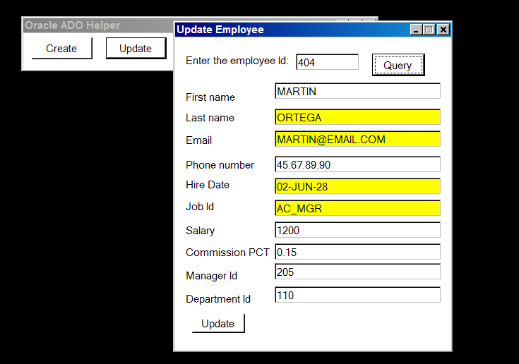
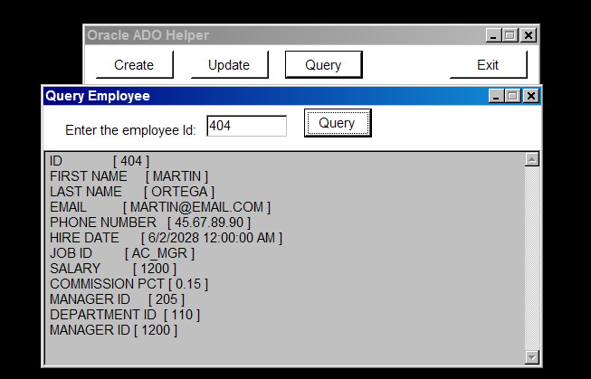

# Utilizando las clases de ADO.NET en Oracle.

Hace tiempo hice unas clases de ADO.NET para Oracle, un helper para las clases de ADO.NET. 
Quizás no es la manera más optima de acceder a una base de datos, pero al menos en ambientes restringidos en donde existen aplicaciones legadas donde no es posible utilizar frameworks u otro proveedor de ADO.NET para Oracle que no sea el que viene predeterminado por Oracle.

Este ejemplo utiliza las siguientes clases
<ol>
<li><b>OracleDatabase:</b> Clase para manejar la conexion a la base de datos.</li>
<li><b>OracleDataBaseCommand:</b> Clase auxiliar para ejecutar los comandos en la base de datos.</li>
<li><b>CommandTexts:</b> Clase en donde se encuentran los comandos parametrizados.</li>
<li><b>EmployeeManager:</b> Clase que utiliza las clases auxiliares para guardar un objeto.</li>
<li><b>Employee:</b> Clase que representa una entidad de negocio, en este ejemplo es equivalente a una tabla.</li>
</ol>

Las siguientes screenshots demuestran el ejemplo, utilizando el Oracle Helper para crear, actualizar y consultar una registro en la base de datos.

<b>Fig 1. Programa en ejecuccion</b>

<b>Fig 2. Crear un nuevo empleado.</b>

<b>Fig 3. Actualizar un empleado.</b>

<b>Fig 4. Consultar los datos de un empleado.</b>

